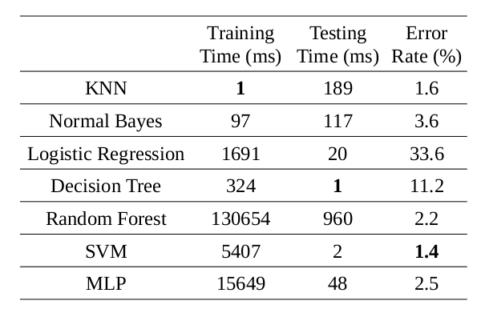

# digit_classifiers
This repo contains examples to use OpenCV's Machine Learning module for digit classification. It includes the following algorithms:

1. KNN
2. Normal Bayes
3. Logistic Regression
4. Decision Tree
5. Random Forest
6. SVM
7. Multi-Layer Perceptron

## How to build?
```
g++ -O3 main.cpp `pkg-config --cflags --libs opencv4`
```
## Results
This table shows the results of running all models on an i7-5600U Intel CPU


## Appendix 
For more details read my post [here](http://imrid.net/?p=4497).
